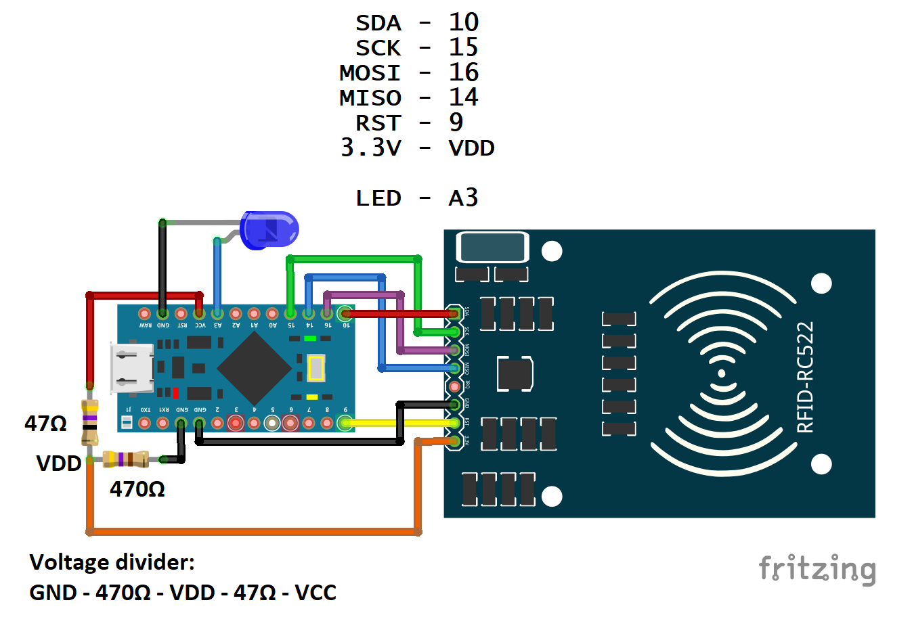
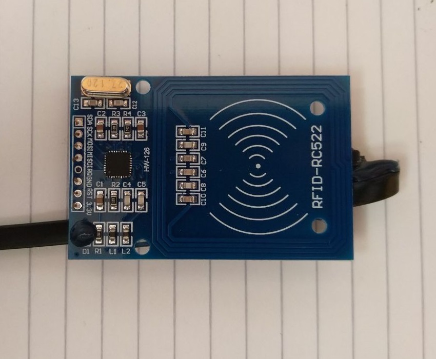
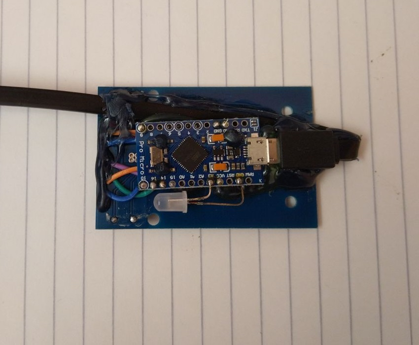

# Scribe

A small DIY programmable NFC/MIFARE development board, made from an Arduino Pro Micro and a MFRC522 module.

## Schematic

## Firmware

You can create your own firmware for Scribe to accomplish your desired task.  
You can flash it with the Arduino IDE software, selecting the **Arduino Leonardo** board.  
The [test firmware](firmwares/test/test.ino) can be used a template.

These are the firmwares I've written for my own tasks:
- [Write a dump on a MIFARE UID changeable tag](firmwares/write_dump_uidc/write_dump_uidc.ino)

### Requirements
- [MFRC522 lib](https://github.com/miguelbalboa/rfid)

## Assembly procedure

This is my assembly procedure:

- Solder wires to RC522 headers
- Place Arduino in ideal position, flipped around the header of the RC522
- Cut and strip wires to length
- Solder all wires except 3.3V
- Solder voltage divider resistors together
- Wrap VDD resistors leads connection with 3.3V wire
- Insert voltage divider through Arduino holes
- Solder voltage divider
- Solder 3.3V wire on VDD
- Bend LED legs to fit next to Arduino
- Solder LED
- Test
- Fold the two boards, with the arduino below the RC522 module
- Hot glue everything in place (including the usb cable for stress relief, the usb connector on the board is not soldered very well)
- Flash desired firmware

## Pictures

## Notes

- You can use [MFC](https://github.com/hexwell/mfc) to do conversions between MIFARE dump file formats and generate code for the _write dump_ firmware.
- If your board ever gets **bricked** you can check out [my guide](https://wiki.hexwell.net/en/electronics/resources/pro_micro_brick.md)
